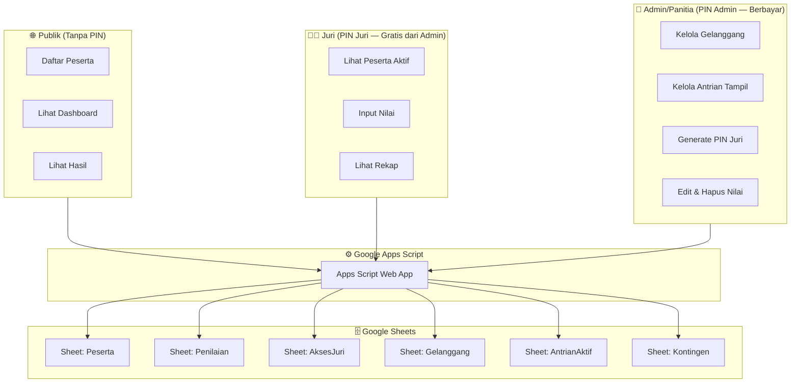
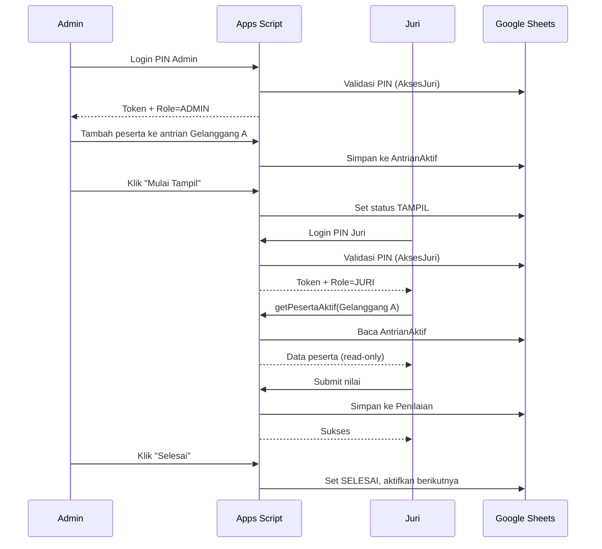
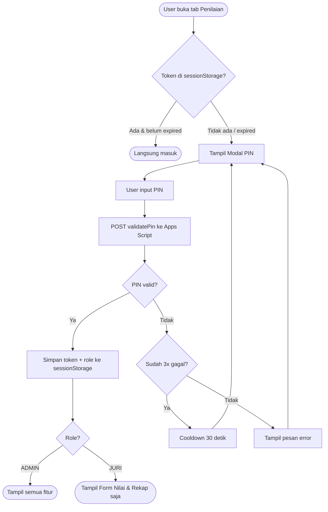
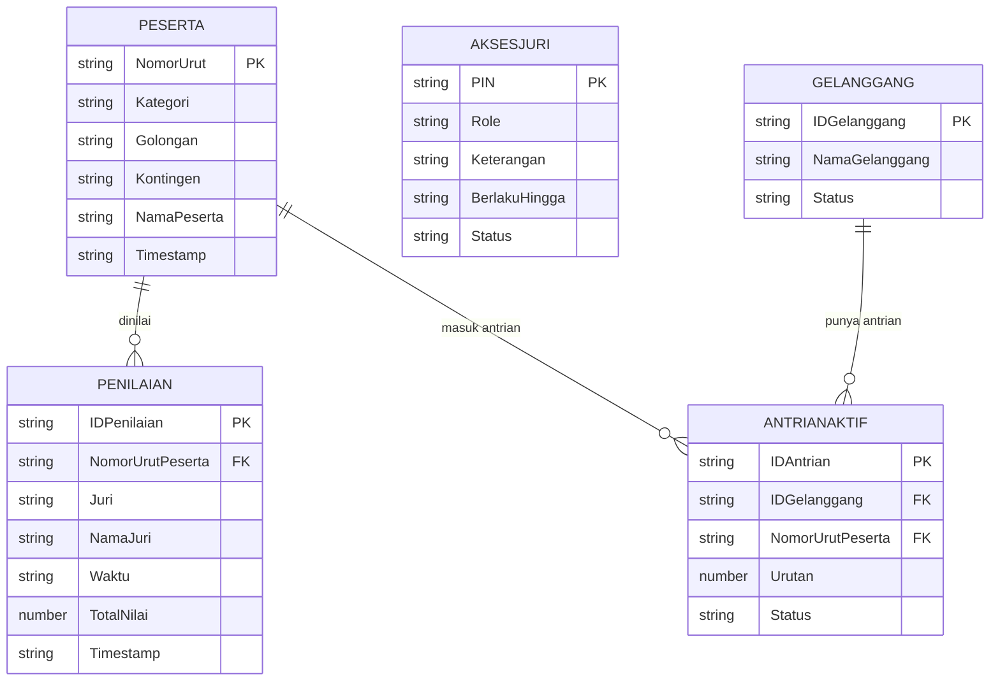

# Pasanggiri — Sistem Pendaftaran & Penilaian Digital (v3 · SaaS Ready)

Web app mobile-first (PWA) untuk lomba Pencak Silat Persinas ASAD.
Backend: **Google Apps Script** · Database: **Google Sheets** · Hosting: **Vercel**

Versi 3 menambah **sistem 3-level akses** (Publik / Juri / Admin) serta
**Gelanggang & Antrian Aktif** — Juri tidak lagi mencari peserta sendiri,
melainkan menilai peserta yang sedang `TAMPIL` di gelanggangnya, diatur oleh Admin.

---

## Fitur

- 📝 **Pendaftaran** peserta dengan nomor urut otomatis `KODE-GOL-KAT-NNN`
- 🥋 **Dashboard** peserta: filter, ringkasan, edit/hapus
- 👨🏼‍🏫 **Penilaian** dengan **PIN server-side** & menu dinamis sesuai role
- 🏟️ **Gelanggang & Antrian** (Admin): atur urutan tampil, peserta aktif terkunci untuk Juri
- 🔑 **Generate PIN Juri** (Admin): buat & nonaktifkan PIN juri gratis
- 🏆 **Hasil** publik: juara umum kontingen + peringkat per kategori/golongan
- 📲 **PWA**: installable & app shell yang bisa diakses offline

---

## Arsitektur Sistem



---

## Alur Penilaian Juri



---

## Alur Validasi PIN



---

## Level Akses

| Fitur | Publik | Juri | Admin |
|---|---|---|---|
| Pendaftaran peserta | ✅ | ✅ | ✅ |
| Dashboard peserta | ✅ | ✅ | ✅ |
| Halaman hasil | ✅ | ✅ | ✅ |
| Input nilai | ❌ | ✅ | ✅ |
| Lihat rekap nilai | ❌ | ✅ | ✅ |
| Kelola antrian tampil | ❌ | ❌ | ✅ |
| Edit / hapus nilai | ❌ | ❌ | ✅ |
| Kelola gelanggang | ❌ | ❌ | ✅ |
| Generate PIN Juri | ❌ | ❌ | ✅ |

| Role | Cara Dapat PIN | Biaya |
|---|---|---|
| Publik | Tidak perlu PIN | Gratis |
| Juri | Dibuat oleh Admin, dibagikan hari H | Gratis |
| Admin | Dari developer via lynk.id | Berbayar per event |

---

## Struktur Google Sheets



### Header tiap sheet

| Sheet | Kolom |
|---|---|
| `Peserta` | Nomor Urut · Kategori · Golongan · Kontingen · Nama Peserta · Timestamp |
| `Penilaian` | ID Penilaian · Nomor Urut · Kategori · Golongan · Kontingen · Nama Peserta · Juri · Nama Juri · Waktu · Keluar Gelanggang · 8 kriteria · Total Nilai · Timestamp |
| `AksesJuri` | PIN · **Role** · Keterangan · Berlaku Hingga · Status · Dibuat · Terakhir Digunakan |
| `Gelanggang` | ID Gelanggang · Nama Gelanggang · Status |
| `AntrianAktif` | ID Antrian · ID Gelanggang · Nomor Urut Peserta · Urutan · Status · Timestamp Mulai |
| `Kontingen` | Nama · Kode |

> Sheet `AntrianAktif.Status`: `MENUNGGU` → `TAMPIL` → `SELESAI`.

---

## Struktur File

```
/
├── index.html               # UI (4 halaman + subtab role + modal)
├── style.css                # Tema seni tradisional Sunda
├── app.js                   # Logika frontend (PIN, role, gelanggang, antrian)
├── config.js                # ⚙️ SATU-SATUNYA file yang diubah saat clone event
├── manifest.json            # Manifest PWA
├── service-worker.js        # Cache app shell (offline-ready)
├── peraturan-pasanggiri.pdf # Ganti dengan PDF peraturan event
├── icons/                   # Ikon PWA (192, 512, maskable)
├── tools/                   # Skrip generator ikon & PDF placeholder
└── apps-script/
    └── Code.gs              # Backend Apps Script (Web App)
```

---

## Setup Backend (Google Apps Script + Sheets)

1. Buat **Google Sheet baru** (kosong). Salin **ID** dari URL-nya
   (`https://docs.google.com/spreadsheets/d/<ID>/edit`).
2. Buka **Extensions → Apps Script**, hapus isi default, tempel `apps-script/Code.gs`.
3. Ubah `SPREADSHEET_ID` di baris atas `Code.gs` menjadi ID Sheet Anda.
4. Jalankan fungsi **`initSheets`** sekali. Ini membuat semua sheet
   (`Peserta`, `Penilaian`, `AksesJuri`, `Kontingen`, `Gelanggang`, `AntrianAktif`)
   dan menyemai **1 PIN Admin default** di `AksesJuri` baris pertama.
   Fungsi ini **idempotent** — aman dijalankan berkali-kali tanpa menghapus data.
5. **Deploy → New deployment → Web app**:
   - Execute as: **Me**
   - Who has access: **Anyone**
   - Salin URL deploy yang berakhiran `/exec`.

> **Migrasi dari v1/v2:** `initSheets()` otomatis menambahkan kolom **Role** ke
> sheet `AksesJuri` lama dan menandai PIN lama sebagai `ADMIN`.

## Setup Frontend

Edit `config.js`:

```js
APPS_SCRIPT_URL: 'https://script.google.com/macros/s/XXXX/exec',
SPREADSHEET_ID:  'ID_SHEET_ANDA',
// Daftar kontingen dikelola di sheet "Kontingen" (Nama | Kode)
GOLONGAN:        [ /* golongan usia */ ],
JURI_LIST:       [ /* daftar posisi juri */ ]
```

> `config.js` **tidak menyimpan PIN sama sekali**. PIN dikelola penuh di server.

---

## Cara Kerja (Hari H)

**Admin:**
1. Login PIN Admin → tab **Antrian & Gelanggang**.
2. Buat gelanggang (`+ Gelanggang`), lalu `+ Tambah ke Antrian` untuk mengisi urutan.
3. Klik **▶ Mulai** pada peserta pertama → status `TAMPIL`.
4. Setelah semua juri selesai → klik **✔ Selesai** → peserta berikutnya otomatis `TAMPIL`.
5. Tab **Generate PIN Juri** → buat PIN untuk tiap juri, bagikan, bisa di-nonaktifkan.

**Juri:**
1. Login PIN Juri → tab **Form Nilai**.
2. Pilih gelanggang tempat bertugas → data peserta aktif muncul otomatis (read-only).
3. Pilih posisi juri + nama → isi nilai → simpan. Tidak ada pencarian peserta.

---

## Menjalankan & Memasang sebagai Aplikasi (PWA)

PWA wajib disajikan lewat **HTTPS** (atau `localhost`).

```bash
# uji lokal dari folder proyek
python3 -m http.server 8080
# buka http://localhost:8080
```

**Produksi (Vercel):** push folder ke GitHub lalu import ke Vercel sebagai static
site (tanpa build command). Domain Vercel sudah HTTPS.

---

## Aturan Penilaian (ringkas)

- Total nilai live; warna emas ≥210, hijau ≥230.
- Non-BERPASANGAN: waktu > 190 dtk (ATT > 300 dtk) → KEMANTAPAN otomatis 20 (terkunci).
- BERPASANGAN: ideal 2:00; selisih 5–10 dtk → −5, >10 dtk → −15; setiap keluar
  gelanggang → −5. Penalti **sudah dipotong** dari total yang disimpan.
- Nilai akhir: ≥3 juri → trimmed (buang nilai tertinggi & terendah),
  <3 juri → jumlah semua.

---

## Clone untuk Event Baru

1. Salin seluruh folder.
2. Buat Sheet + Apps Script baru, jalankan `initSheets`, deploy.
3. Update `config.js` (`APPS_SCRIPT_URL`, `SPREADSHEET_ID`, `GOLONGAN`, `JURI_LIST`).
4. Isi sheet `Kontingen` sesuai event. Ganti `peraturan-pasanggiri.pdf`.
5. PIN Admin default ada di sheet `AksesJuri` baris pertama — ganti sesuai kebutuhan.
6. Deploy ulang frontend ke Vercel.

---

## Catatan Penting

- PIN tidak pernah ada di kode frontend — validasi sepenuhnya server-side.
- Token sesi di `sessionStorage` berlaku 24 jam, hilang saat browser ditutup.
- Juri tidak bisa memilih peserta sendiri — diatur Admin via antrian gelanggang.
- `LockService.getScriptLock()` dipakai di semua operasi write untuk cegah race condition.
- Cooldown 3x gagal login (30 detik) dikelola di frontend via `sessionStorage`.
- Font size input minimal 16px untuk cegah auto-zoom di iOS Safari.
- `AksesJuri` mendukung banyak PIN aktif sekaligus (1 Admin + N Juri).
- Setiap kali file app shell berubah, naikkan `CACHE_VERSION` di `service-worker.js`.
